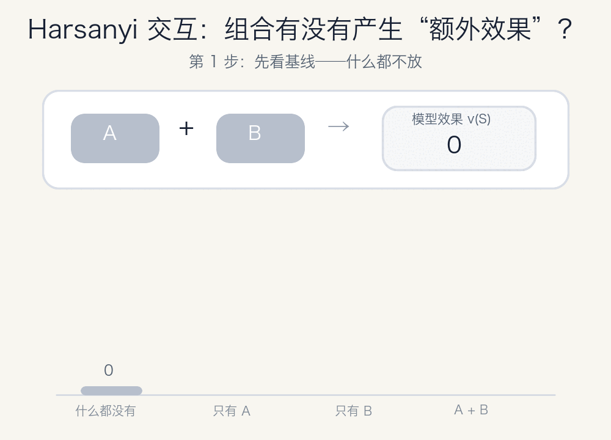

# Harsanyi 交互：怎样算出“1 + 1 大于 2”的部分？

我们经常会说：

> 两个因素放在一起，产生了“1 + 1 大于 2”的效果。

但这个“多出来的效果”到底是多少？它属于第一个因素、第二个因素，还是只属于它们的组合？

Harsanyi interaction（Harsanyi 交互）就是用来回答这个问题的。



## 一个最简单的例子

假设我们有两个因素，叫作 A 和 B。

我们分别测试四种情况：

| 使用的因素 | 得分 |
|---|---:|
| 什么都不用 | 0 |
| 只用 A | 2 |
| 只用 B | 3 |
| 同时使用 A 和 B | 9 |

如果 A 和 B 互不影响，那么同时使用它们时，我们预期得到：

```text
2 + 3 = 5
```

但实际得分是 9，比预期多了 4：

```text
9 - 5 = 4
```

这多出来的 4 既不能只归给 A，也不能只归给 B。它只有在 A 和 B 一起出现时才产生，因此应该归给组合 `{A, B}`。

这个组合额外产生的效果，就是 A 和 B 的 Harsanyi 交互。

## 为什么公式里还要加上“什么都不用”？

两个因素的 Harsanyi 交互写成公式是：

```text
I({A, B}) = v({A, B}) - v({A}) - v({B}) + v(∅)
```

其中：

- `v({A, B})` 是同时使用 A 和 B 的得分；
- `v({A})` 是只使用 A 的得分；
- `v({B})` 是只使用 B 的得分；
- `v(∅)` 是什么都不使用时的基础得分。

代入刚才的数字：

```text
I({A, B}) = 9 - 2 - 3 + 0 = 4
```

之所以要加回 `v(∅)`，是因为减去 `v({A})` 和 `v({B})` 时，基础得分被重复减了两次。

例如，如果什么都不用也能得到 1 分，那么：

```text
只用 A 的 2 分 = 基础 1 分 + A 自己贡献的 1 分
只用 B 的 3 分 = 基础 1 分 + B 自己贡献的 2 分
```

计算交互时减去两个单独得分，会把基础分减掉两次，所以最后必须加回来一次。这和容斥原理的思路完全相同。

## 正交互、负交互和零交互

Harsanyi 交互的正负号很容易理解。

### 正交互：互相增强

```text
I({A, B}) > 0
```

A 和 B 一起出现，比它们各自贡献的简单相加更好。这通常被称为协同作用。

### 负交互：互相干扰

```text
I({A, B}) < 0
```

A 和 B 单独都有用，但同时出现时互相干扰，组合效果低于预期。

### 零交互：彼此独立

```text
I({A, B}) = 0
```

组合效果刚好等于各自效果相加，没有产生额外影响。

## 不只有两个因素

如果有 A、B、C 三个因素，我们不仅可以计算：

- A 自己的贡献；
- B 自己的贡献；
- C 自己的贡献；
- A 和 B 的二阶交互；
- A 和 C 的二阶交互；
- B 和 C 的二阶交互；
- A、B、C 三者共同产生的三阶交互。

三阶交互表示：只有三个因素同时出现时才产生、并且不能被任何单个因素或两两组合解释的效果。

对任意因素集合 `S`，通用公式是：

```text
I(S) = Σ_{T ⊆ S} (-1)^(|S|-|T|) v(T)
```

公式看起来有些抽象，但它做的事情仍然很简单：

> 从组合的总效果中，逐层减掉更小组合已经能够解释的部分，最后留下只属于当前组合的效果。

## 它怎样用来解释语言模型？

在语言模型中，我们可以把 prompt 里的每个 token 当成一个因素，也就是一个 player。

例如：

```text
The president of US is
```

我们想知道模型为什么更倾向于生成某个目标答案。可以进行下面的实验：

1. 枚举 prompt token 的所有子集；
2. 保留子集中的 token；
3. 把没有选中的 token 替换成 baseline token；
4. 计算模型生成目标答案的 log-probability；
5. 把所有子集的得分转换成 Harsanyi 交互。

最后得到的高阶交互可以告诉我们：哪些 token 必须一起出现，才会明显提高或降低目标答案的概率。

比如，某个 token 单独看没有明显作用，但它和另一个 token 同时出现时产生了很强的正交互。这说明模型使用的可能不是孤立关键词，而是它们共同组成的语义模式。

## 最小代码实现

这个仓库的 [`harsanyi.py`](harsanyi.py) 提供了一个不依赖任何第三方库的最小实现。

```python
from harsanyi import calculate_harsanyi


def value_function(coalition):
    table = {
        (False, False): 0.0,
        (True,  False): 2.0,
        (False, True):  3.0,
        (True,  True):  9.0,
    }
    return table[coalition]


result = calculate_harsanyi(value_function, n_players=2)

for mask, interaction in zip(result.masks, result.interactions):
    print(mask, interaction)
```

输出为：

```text
(False, False) 0.0
(True,  False) 2.0
(False, True)  3.0
(True,  True)  4.0
```

最后一行的 `4.0` 就是 A 和 B 的二阶交互。

LLM token 版本可以使用 [`llm_harsanyi.py`](llm_harsanyi.py) 中的 `attribute_tokens()`。

## 一个必须注意的限制

精确计算 Harsanyi 交互需要检查所有子集。如果有 `n` 个因素，就有 `2^n` 个子集：

| 因素数量 | 子集数量 |
|---:|---:|
| 10 | 1,024 |
| 15 | 32,768 |
| 20 | 1,048,576 |

因此，在解释语言模型时，通常要使用较短的 prompt，或者先把多个 token 合成一个 player group。

代码内部使用 fast Möbius transform 计算交互，不会创建巨大的 `2^n × 2^n` 矩阵。不过，模型仍然需要计算全部 `2^n` 个子集，这是精确方法本身无法避免的成本。

## 总结

Harsanyi 交互可以用一句话概括：

> 一个组合的 Harsanyi 交互，是这个组合的总效果中，不能被任何更小组合解释的部分。

它把模型效果拆成了不同层次：

- 单个因素自己的贡献；
- 两个因素共同产生的额外贡献；
- 三个因素共同产生的额外贡献；
- 更高阶组合独有的贡献。

所以，当我们说“模型不是只看某个 token，而是在利用一组 token 的组合”时，Harsanyi 交互提供了一种可以实际计算和比较的方法。
